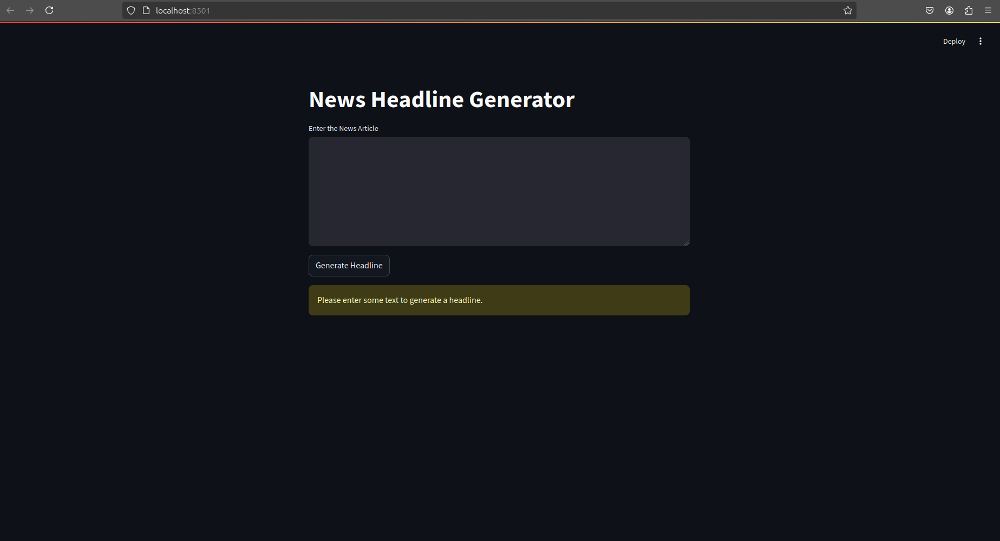
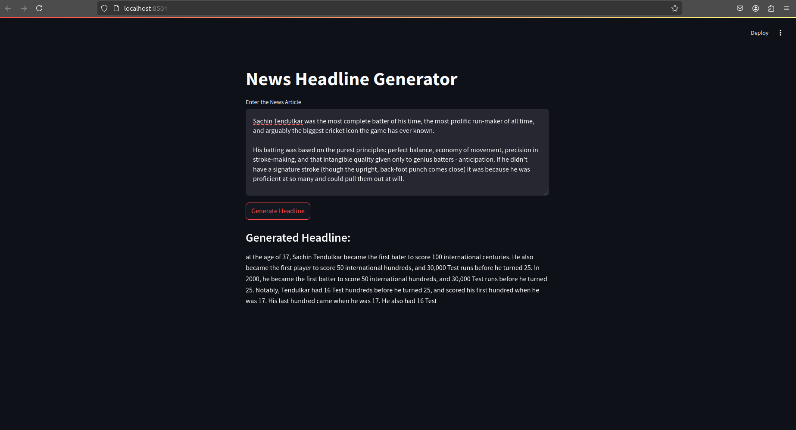
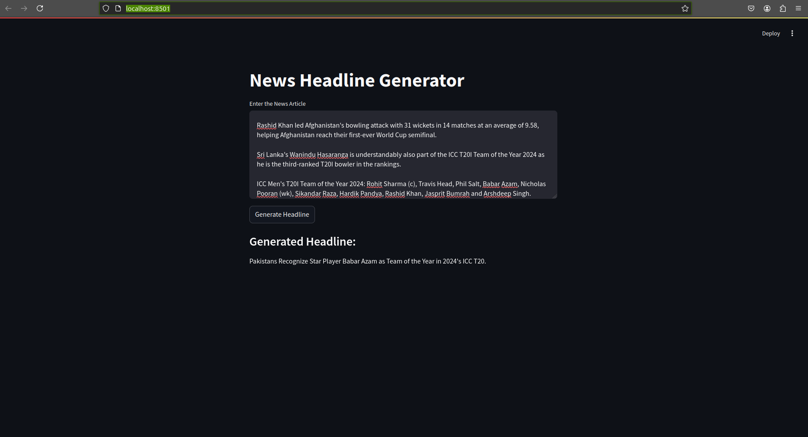

# Headline Generator App
Given the detail of news and generate headline using FlanT5 pretrained Language model on new headlines. For detail of FlanT5 and DeepSeek-R1-Distill-Qwen-1.5B (using ollama) pretrained Language model you can refer [here](https://huggingface.co/mrm8488/t5-base-finetuned-summarize-news).
## Demo



## Setup
create conda virtual environment
```
conda create -n env_name python=3.11.11 -y
```
install requirements
```
pip install -r requirements.txt
```

run app
```
streamlit run app.py
```